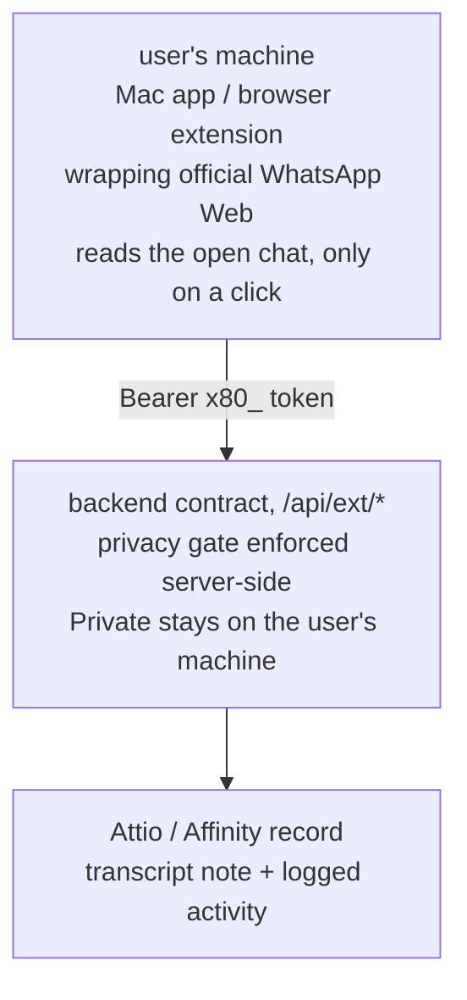

For many funds and founders, the real conversation (the "can you do $2m at that cap?" message) happens on WhatsApp, and the CRM never hears about it. By the end of this guide you will understand, and be able to build or evaluate, a pipeline that fixes that without automating your WhatsApp account, without an unofficial WhatsApp API, and without any background process reading anything you did not explicitly share. The shape: an app on your machine wraps the official WhatsApp Web, reads **only the chat you have open, only when you click**, and pushes it through an authenticated backend (the server-side half of the system) into Attio or Affinity, with the privacy decision enforced on the server.

This is the architecture of [80x](/projects/80x/), the author's own product: a native Mac app with a CRM sidebar, mirrored by a browser extension over the same backend. Unlike the other guides, the grounding system is a full product rather than a repo you can copy, so this page reads as an architecture walkthrough with each design decision justified. Where a step generalizes beyond what 80x ships, the text says so explicitly.

:::note[What you'll build]
An understanding of a four-part pipeline, deep enough to adopt it, commission it, or build it: an app on the user's machine that wraps the real WhatsApp Web; a sync button that captures only the open chat; a backend that matches the conversation to the right CRM record; and a server-enforced privacy rule that keeps private chats private even if the app misbehaves.
:::

:::note[What you need]
- **If you want the result, not the build:** [80x](/projects/80x/) is the shipped product; using it requires no technical work.
- **If you are building your own:** this is the most technical guide on the site. It spans a native Mac app (or browser extension), a backend service, and CRM integrations, which is real product engineering rather than an afternoon script. An AI assistant such as Claude can produce much of the code, but plan for ongoing maintenance (step 2 explains why).
- **Either way:** a CRM with an API, meaning a doorway that lets programs read and write its records (Attio or Affinity here), and the reasoning in [CRM as database](/reference/crm-as-database/) for why captured conversations belong there.
:::

## Why WhatsApp is where deals leak

The relationship record in the CRM shows a meeting three weeks ago while the deal advanced daily in a chat thread. Every system built on the CRM inherits that hole: dashboards, qualification agents, pipeline reviews (see [CRM as database](/reference/crm-as-database/)). So the capture problem is worth solving. But the two obvious solutions are worse than the hole:

- **Unofficial WhatsApp APIs** (reverse-engineered software that connects to WhatsApp pretending to be a phone) can bulk-read an account. They also get phone numbers banned.
- **Cloud-side capture** (forwarding chats to a server that parses them) means every message, including personal ones, passes through infrastructure the user does not control, before anyone decides what was business.

:::caution
For someone whose deal network lives on their WhatsApp number, a ban is catastrophic and irreversible. There is no appeal path that reliably works, and the number's chat history and groups do not come back. Treat any tool that automates a personal WhatsApp account as a risk to the asset itself.
:::

The architecture below is a set of refusals of those two options.

## The design principles

80x's safety model is that every WhatsApp interaction is **human-shaped**:

| Principle | Concretely |
|---|---|
| Human-initiated | Nothing happens until the user clicks. No background jobs, no scheduled scraping |
| On-screen only | The client reads *only the chat currently open*, when asked. It never enumerates chats or scrolls history unattended |
| Human-paced | The user acts at human speed in the real client; snippets insert into the composer but *the user* hits send |
| Official client underneath | The app wraps the real `web.whatsapp.com` — no unofficial API of any kind. To WhatsApp it is indistinguishable from a browser |
| Privacy gated server-side | Whether a conversation syncs is enforced by the backend, so nothing private leaks even on a client bug |

The reasoning behind the first four: ban risk is **behavioral, not technological**. A wrapped official client whose behavior is identical to a person using WhatsApp Web presents nothing to detect. That constraint (behave exactly like a human) turns out to produce the right *privacy* architecture too, which is the deeper lesson of this guide.

Here is the whole pipeline in one picture:

## Step 1 — capture at the client, on the user's machine

The capture surface is a native Mac app hosting the official WhatsApp Web inside a `WKWebView` (the Mac's built-in browser engine, the one Safari uses), set to identify itself as desktop Safari so WhatsApp serves the full client. A browser extension mirrors the same flow for users who prefer the browser: one backend, two front ends.

Capturing at the client is the load-bearing privacy decision. The user's WhatsApp session, the message content, and the choice of what to share all live on their machine. The backend only ever receives what a human explicitly pushed. There is no server holding a WhatsApp login, and nothing to breach that contains conversations nobody chose to share.

Wrapping someone else's web app safely means hardening the shell against hostile content. The shipped details are worth copying if you build any wrapper:

- **Strict navigation guard:** only `whatsapp.com` and its subdomains may load inside the app. The check is exact-match or dotted-suffix (`== "whatsapp.com"` / `.hasSuffix(".whatsapp.com")`), never a "contains" check, which would accept a lookalike address such as `evil-whatsapp.com.attacker.io`.
- **External links** open in the user's normal browser, and only for safe link types (`http/https/mailto/tel/sms`). A hostile page crafting a `file:` or custom-scheme link gets refused.
- **Camera, microphone, file picker, and pop-up dialogs** are all allowed only for whatsapp.com itself, and the app runs sandboxed with the minimum system permissions.

If you are evaluating a wrapper rather than building one, these three items are the checklist to ask about.

## Step 2 — read only the open chat, on an explicit click

A small script injected into the page reads the *open* chat's content on demand: the user opens a conversation and clicks **Sync this chat to CRM**. That click is the only trigger. There is no crawler, no walking the chat list, no unattended scrolling through history.

An honest caveat from the product's own docs: the reader depends on WhatsApp Web's page structure, which is deliberately obfuscated and changes without notice, so the reading code needs occasional upkeep. That is the maintenance price of refusing unofficial APIs, and it is the right trade.

The verifiable property of this step: with the app open all day and no clicks, nothing is captured. The check for that is in "Check your work" below.

## Step 3 — send it through an authenticated backend contract

The client is deliberately thin: a small piece of code that talks to the backend's `/api/ext/*` endpoints (the fixed set of addresses the backend answers on), authenticated with a workspace API token (`Bearer x80_…`), a password-like credential the user creates in the web app once. On a Mac it is stored in the Keychain, the system's encrypted password store. The flow on that click: read the open chat, send the conversation to the backend, get back CRM match suggestions, then let the user link, set privacy, and sync.

Two conventions in that contract generalize to any client-capture system:

- **Values sent over the wire are plain strings, never fixed lists.** Field kinds, activity kinds, CRM names: all strings, so a newer backend value can never break an older client, and unknown kinds display with a sensible fallback. Apps installed on users' machines update more slowly than servers.
- **Reads degrade quietly; writes fail loudly.** A background read that hits a route the backend does not serve yet simply hides its panel and raises no alarm. But a failure on an *explicit user action* (Save, Log) shows an error, because silently swallowing something the human deliberately did is worse than a visible failure.

## Step 4 — match and link against the CRM

A captured conversation is useless until it is attached to the right record. On receiving one, the backend returns **match suggestions** from the CRM (people and companies); the user confirms a match, searches manually, or creates a new contact on the spot. Linking is a human decision with machine-suggested candidates, the same suggest-don't-act posture as the [MEDIC qualification agent](/guides/medic-qualification-agent/).

Once linked, the client can pull the record back into its sidebar (key fields, deal stage, last-contacted and next-step dates) and edit fields or log activities from there, every write explicit and human-initiated.

One subtle correctness point: the "last contacted" date shown in the client is real CRM time from the record's activity history, kept deliberately separate from the WhatsApp thread's own message timestamps, so the relationship timeline reflects the CRM's truth.

After this step, syncing a chat ends with a concrete, checkable result: the conversation attached to the right person or company in the CRM.

## Step 5 — enforce privacy server-side, per conversation

Each conversation carries a privacy state (**Private** or **Shared**) that the user can flip at any time, plus a per-message share for surfacing a single relevant message out of an otherwise private thread. The gate is enforced by the backend, not the client.

The threat model in plain terms: client software has bugs, and the injected reader rides a page that changes underneath it. If the privacy decision lived in the client, a client bug could leak a private conversation. With the server enforcing it, the worst a broken client can do is fail to sync something shareable, which is an inconvenience rather than a breach.

What is and is not stored: the CRM and the backend hold only what the user explicitly transmitted, meaning shared conversations, individually shared messages, and the notes and activities logged against records. **"Sync now" rebuilds the CRM note from everything transmitted**, so the record's transcript note always reflects the shared history. Private conversations, and every chat never shared, stay on the user's machine inside WhatsApp Web.

## Step 6 — write summaries and activities, not dumps

Two distinct write shapes reach the CRM, and keeping them distinct is a design decision. **Transcript sync** maintains a clean conversation note on the linked record. **Activity logging** records that a conversation happened, as an entry on the relationship timeline. For activities, the client deliberately sends a short human-readable summary as the body ("WhatsApp conversation — 24 messages") with the conversation ID and channel attached as metadata for attribution and duplicate detection, rather than dumping transcript text into the activity stream. Activities are for the timeline; transcripts are for the record's note. Mixing them makes both unreadable.

The backend then writes to Attio or Affinity through its connectors; the client does not know or care which CRM it is talking to, it just displays which one.

## Check your work

For an 80x user, the loop is checkable in two minutes: open a chat, click **Sync this chat to CRM**, confirm the suggested match, then open the record in Attio and see the conversation note. Then flip the conversation to Private, add messages to the chat, sync again, and confirm nothing new reached the CRM.

If you are building your own capture pipeline on this architecture, verify the two properties that carry the whole design:

1. **The privacy gate is really server-side.** Attempt to sync a private conversation using a modified or misbehaving client; the backend must refuse. If you can only test this from a well-behaved client, you have not tested it.
2. **Nothing moves without a human.** Leave the client running against active chats for a full day with no clicks, then confirm the backend received zero captures.

## If something goes wrong

- **The sync button captures nothing, or garbles the chat.** WhatsApp Web's page structure changed and the reader's selectors need updating. This is the known, recurring maintenance cost from step 2; budget for it.
- **You are worried about the account being banned.** The protection is behavioral: the wrapped official client, human-initiated actions at human speed, and no bulk reading. If a tool in your stack automates sending or reads chats in the background, that is the risk to remove first.
- **A private conversation shows up in the CRM.** The privacy gate is not actually server-side, or the client is bypassing it. Re-run the modified-client test in "Check your work"; a client-side-only gate is the single most serious defect this architecture can have.
- **An explicit Save or Log appears to succeed but the CRM shows nothing.** The contract says writes must fail loudly. If yours fail quietly, fix the error surfacing before users lose trust in the button.

## Variations

- **Other channels.** The backend contract tags each conversation with its channel (`channel: "whatsapp" | "linkedin"`), so the same capture-at-client, gate-at-server shape extends to any conversation surface a person works in through a web client. This is a property of the architecture; WhatsApp is the shipped channel.
- **Affinity versus Attio.** The contract hides the CRM behind the backend connector; the front ends are unchanged.
- **Generalizing beyond the product.** The transferable core is four decisions: wrap the official client, capture on-screen content on a human's click, keep the client thin behind an authenticated contract, and enforce privacy on the server. Everything else (SwiftUI, Keychain, the sidebar) is implementation detail.

## See also

- [80x](/projects/80x/) — the shipped product this architecture comes from.
- [CRM as database](/reference/crm-as-database/) — why captured conversations belong in the CRM, and what compounds on top once they are there.
- [Build a MEDIC deal-qualification agent](/guides/medic-qualification-agent/) — an agent that reads exactly the notes this pipeline creates.
