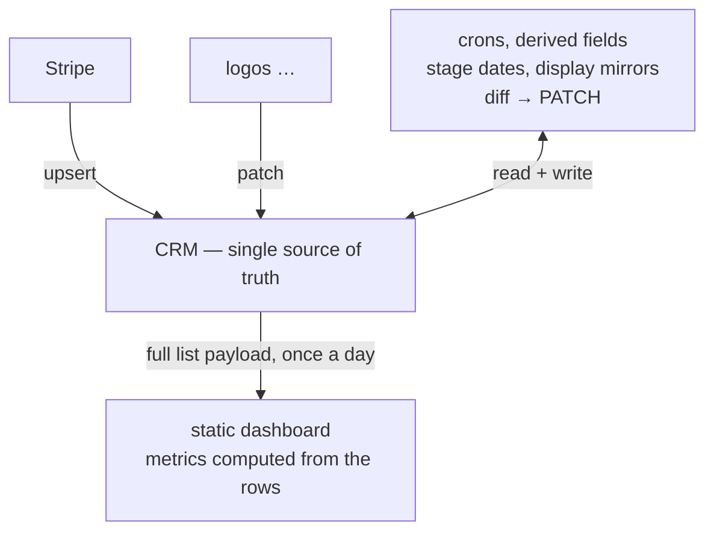

**CRM as database** is the pattern of treating your CRM (Attio, Affinity, or equivalent) as the firm's single source of truth: the one operational database where deal flow, meeting notes, and LP records all live, and that every automation, agent, dashboard, and sync job reads from and writes to. You do not set up a separate database, a data warehouse (a specialized system for large-scale analysis), or an internal app with its own copy of the data. The CRM already provides the data structure, the storage, the permissions, and the screens your team looks at every day, so machines are made to work inside it rather than beside it.

## Why this matters for your fund

This one architectural decision is behind most of the systems documented on this site, and it is the difference between automation your team actually sees and automation that quietly diverges from reality. The deal flow partners review, the meeting notes agents file, and the LP records a fundraise runs on are all the same records the machines maintain, which is what "the firm's single source of truth" means in practice. Once you commit to it, everything else falls into place: [cron agents](/reference/cron-agents/) become jobs that keep CRM fields current, dashboards become read-only views computed from the CRM's own data, and [agents that write](/reference/writing-agents-safely/) get a well-defined, human-visible place to put their output. It also keeps your engineering bill small, because you are not building or maintaining a second system.

## Why not a parallel database

The instinctive architecture for fund tooling is: pull CRM data into your own database, build features on top, sync changes back. This fails for small teams in predictable ways:

- **Two sources of truth immediately diverge.** Every record edited in the CRM but not yet synced is wrong in your database, and vice versa. You now own a two-way sync problem, one of the hardest problems in software, to support a five-person team.
- **You rebuild what the CRM ships for free.** Permissions, edit history, a record screen, mobile access, mentions, notes, email enrichment: all of it exists already, and your team already trusts it.
- **Humans stop looking at your app.** The partner checks the CRM. If your computed data lives elsewhere, it is invisible at the moment of decision.

The alternative: accept the CRM's data model as your structure and make every machine a citizen of it. Automations read the CRM through its API (the doorway programs use to read and write a system's data), compute what they need, and write results back into fields on the same records humans see.

The diagram below shows the whole architecture: outside systems and scheduled jobs all write into the CRM, and the dashboard reads out of it once a day.



Notice that every arrow points into or out of one box. The CRM is the only place data lives; everything else computes and passes through.

## Records, lists, and attributes as your data structure

In Attio terms, the mapping between CRM concepts and database concepts is direct. If you have never touched a database, read the middle column as "the spreadsheet equivalent": an object is a sheet, a record is a row, an attribute is a column.

| CRM concept | Database analog | Example |
|---|---|---|
| Object (companies, people, custom) | Table | A custom `stripe_customers` object; a custom `lps` object |
| Record | Row | One company, one LP |
| Attribute | Typed column (text, date, currency, select, record reference) | `deal_stage`, `total_revenue`, `pre_ic_date` |
| List + entry | Join table with its own columns | A "Dealflow" list whose entries carry per-deal stage dates |
| Record reference | Foreign key | LP → linked company; Stripe customer → person, matched by email |
| Select options | Enum | Stage titles, pass reasons |

Two habits make this structure workable for machines:

1. **Give every external entity a match key.** A revenue sync for a consumer SaaS company upserts (updates the existing record, or creates one if missing) into a custom object keyed on a unique `stripe_customer_id` attribute. Upserts by match key are idempotent, the engineering word for "safe to run twice": run the job again and the second run changes nothing, which is the core requirement of [automation safety](/reference/automation-safety/).
2. **Decide who owns each field.** Some fields are human-owned (stage, notes, next step); some are machine-owned (display mirrors, stamped dates, synced revenue). A machine never overwrites a human-owned field, and a human should never need to hand-edit a machine-owned one. The split is a convention, not something the CRM enforces, so document it and make every job respect it.

## Machine-owned derived fields

The CRM cannot compute; it stores what you put in it. So derived values (formatted mirrors, stage-transition dates, lifetime revenue) are maintained by outside jobs that treat the relevant fields as theirs.

### Display mirrors

A European PE platform's report views needed currency amounts rendered as text ("EBITDA: 4.5m €") because the views could not format currency fields the way the team wanted. The fix is a machine-owned text field alongside each currency field, kept in sync by a cron (a job that runs on a timer). The code below computes the text each field should show and updates it only when it differs from what is already there.

```python
CURRENCY_DISPLAY = {
    "amount_invested": ("ca_display", "CA"),
    "ebitda": ("ebitda_display", "EBITDA"),
    "target_raise": ("ticket_display", "Ticket"),
}

for src_slug, (disp_slug, label) in CURRENCY_DISPLAY.items():
    amount = get_currency_value(entry, src_slug)
    if amount is None:
        continue
    want = format_amount(label, amount)          # "EBITDA: 4.5m €"
    if get_text_value(entry, disp_slug) != want:
        patch[disp_slug] = want                  # diff-then-PATCH
```

The shape to notice: compute the desired value, compare it with the current value, and write only on difference (PATCH is the standard API request for updating part of a record). This **diff-then-PATCH reconcile loop** heals itself. If someone edits a source amount, the mirror corrects itself on the next run; if the job misses a run, nothing breaks, because the next run catches up. The data converges on correct rather than depending on every single event being processed.

### Stage dates, and why reconciliation beats webhooks

The same platform needed per-stage entry dates (`pre_screening_date`, `pre_ic_date`, `closed_date`, and so on) to compute funnel conversion and how fast deals move between stages. The first implementation was a webhook, a message the CRM sends to your code the moment something changes: on stage change, stamp today's date. It carried two structural flaws. It only knew about transitions *after* it was deployed, and when it silently died, deals moved through stages with no date stamped. Because the funnel reports keyed off those dates, deals simply vanished from the funnel. Nothing errored; the numbers were just quietly wrong.

The replacement reads the truth instead of trying to catch it in the moment. Attio keeps the full history of a stage field, so a cron can reconstruct the real first-entry date for every stage a deal ever passed through. The request below fetches that history for one deal.

```python
resp = requests.get(
    f"{BASE}/lists/{LIST_ID}/entries/{entry_id}/attributes/deal_stage/values",
    headers=HEADERS,
    params={"show_historic": "true", "limit": 100},
)
for v in resp.json()["data"]:
    title = v["status"]["title"]
    day = v["active_from"][:10]        # earliest active_from per stage wins
```

What comes back is every stage the deal has ever held, each with the date it became active, which is exactly what the funnel needs. The job then fills **only empty date fields**: safe to re-run, and it never overwrites a manually entered date. It runs twice hourly on weekdays, and a missed run costs nothing because the next run backfills everything. See [Build an Attio webhook automation](/guides/attio-webhook-automation/) for when webhooks still make sense, and the [Attio API field guide](/reference/attio-api-field-guide/) for the `show_historic` and value-envelope details.

### External systems as feeds

The same reconcile shape handles data that starts life outside the CRM. Two public examples:

- [memelord-stripe-attio-sync](https://github.com/80x-djh/memelord-stripe-attio-sync) — a daily Python job with no outside dependencies that totals each Stripe customer's lifetime revenue (succeeded charges net of refunds) and per-product spend (paid invoice lines, split pro-rata across discounts), then upserts into a custom Attio object keyed on `stripe_customer_id` and links to the matching person by lower-cased email. Covered in [Sync Stripe revenue into your CRM daily](/guides/stripe-to-crm-sync/).
- [artemis-lp-logo-sync](https://github.com/80x-djh/artemis-lp-logo-sync) — a ~200-line Node script, run every 15 minutes, that fills a `logo_url` field on a fund's custom LP object via a three-tier fallback (linked company's logo → favicon service for the root domain → generated initials avatar), updating only when the value differs. The smallest complete example of the whole pattern; see [The one-file cron sync](/guides/one-file-cron-sync/).

Both jobs are stateless: they remember nothing between runs. All state lives in the CRM, and the job holds nothing but its API keys.

## Dashboards: read the whole list, compute in the page

A fund's pipeline is small by database standards (hundreds of entries, not millions), so you can skip business-intelligence tooling entirely. A KPI dashboard for the PE platform above works like this: a Python generator pages through the full Dealflow list, turns internal references (company names, stage titles, team-member names) into plain text, and emits one data payload in JSON, a simple text format for structured data. Each row it emits looks like the snippet below.

```python
rows.append({
    "company": comp,
    "stage": stage,
    "originators": team,
    "pre_ic_date": date(ev, "pre_ic_date"),
    "closed_date": date(ev, "closed_date"),
    "ticket": ticket,
})
```

Each row is just the fields a funnel calculation needs, already flattened to plain values. The payload is inserted into a single self-contained web page, and *all* metrics (cumulative funnel, stage speed, monthly volume) are computed in the browser from the rows. No server, no query layer, no warehouse: the CRM is read once per day by a GitHub Actions cron (a scheduled job on GitHub's free automation service) and the result is a static page.

:::note[Why the stage-date job above is load-bearing]
The cumulative funnel counts a deal at every stage it has a date for, including deals later killed. So if the date-stamping job dies, the funnel silently under-counts. The dashboard is only as good as the machine-owned fields feeding it.
:::

Full walkthrough in [Ship a self-updating KPI dashboard from your CRM](/guides/kpi-dashboard-from-crm/), and the fund-operations side in [Pipeline hygiene](/playbooks/pipeline-hygiene/).

## When the pattern breaks

CRM-as-database is a deliberate trade, and it has real limits:

- **Analytics at scale.** "Fetch every entry, compute in memory" works to a few thousand records. The CRM API cannot total or cross-reference data for you and limits how fast you can ask; at tens of thousands of records with historical queries, you want a real warehouse fed by a one-way export. One-way, so the CRM stays the sole place writes happen.
- **Files and media.** CRM fields hold values and web addresses, not files. The logo sync stores *addresses* pointing at external services; anything heavier (decks, recordings) belongs in file storage with a link field pointing at it.
- **High-frequency writes.** Rate limits, plus the occasional spurious authentication error under load, make the CRM wrong for anything needing hundreds of writes per minute or all-or-nothing updates across records. Batch, retry, and reconcile instead.
- **Cross-workspace queries.** Each workspace is an island; analysis across funds or clients needs an export layer.
- **Schema drift.** Anyone with admin rights can rename or delete a field your jobs depend on. Build jobs that stop loudly when a field is missing; a crashed run gets noticed, a silent skip does not.

The rule of thumb: if the data is something a human would want to see next to a record while deciding, it belongs in the CRM and machines should maintain it there. If it is high-volume telemetry, media, or history for analysis, feed it out one way and keep the CRM as the operational core.

## See also

- [Cron agents](/reference/cron-agents/) — how these jobs run without any always-on infrastructure
- [Automation safety](/reference/automation-safety/) — idempotency, dry-run gates, "what if it runs twice"
- [Agents that write to your CRM](/reference/writing-agents-safely/) — extending machine ownership to AI agents
- [Attio API field guide](/reference/attio-api-field-guide/) — value envelopes, historic values, and other gotchas these jobs hit
- [The one-file cron sync](/guides/one-file-cron-sync/) — the smallest complete implementation of this pattern
