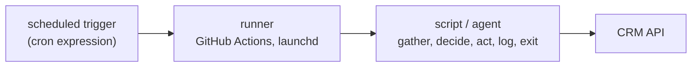

A **cron agent** is an automation that runs on a timer instead of in a chat window. The name comes from cron, the decades-old convention for running a program on a schedule. There is no AI session left switched on, no process waiting for input. A scheduler fires, an ordinary script gathers the current state, makes its decisions, acts, writes a log, and exits. The script calls a large language model (an LLM, the kind of AI behind Claude) only for the steps that genuinely need judgment. Most of the time the LLM is not called at all.

## Why this matters for your fund

This is the workhorse pattern for pipeline hygiene and portfolio monitoring in a fund: stamping deal-stage dates, keeping fields current, extracting qualification signals from notes, syncing revenue from billing systems. Because the work runs on a schedule, the pipeline is already clean before the Monday meeting starts, instead of being tidied during it. It is also the cheapest pattern, because you pay for compute only in the minutes the job actually runs, and often nothing at all for AI. If your fund automates one thing this year, it will probably be a cron agent, so the traps in the second half of this page are worth knowing before you depend on one.

Here is the shape as a diagram: a schedule fires a runner, the runner executes the script, the script talks to the CRM, and then everything shuts down until the next tick.



Two names from the diagram, defined: a **cron expression** is the compact text code that encodes a schedule (one appears later in this page), and **GitHub Actions** is GitHub's free service for running scripts on a schedule; launchd is the equivalent built into Macs. The CRM API is the doorway programs use to read and write your CRM's data. If [an agent](/reference/agents/) is a loop of *model → tool → model*, a cron agent inverts the ratio: it is mostly a fixed pipeline, with the model as one optional step inside it.

## Why not an always-on agent

An agent session that never ends is expensive, hard to audit, and drifts as its context fills with old results. For recurring operational work, none of that buys you anything:

- **Cost.** A predictable sync that runs twice an hour costs GitHub Actions minutes, not AI tokens. In one production MEDIC extraction system (MEDIC is a sales-qualification checklist; the fields are listed in [agents that write to your CRM](/reference/writing-agents-safely/)), the daily cron explicitly runs the pipeline in a no-agent mode: a plain Python script that calls Claude only when a deal has fresh notes. The system's own docs describe the tradeoff as "cheap and predictable."
- **Auditability.** A script that runs, prints a summary, and exits produces a bounded log per run. You can read exactly what happened at 07:37 on Tuesday.
- **Failure isolation.** A crashed run affects one run. The next tick starts clean, from the CRM's current state, with no memory of the failure.

The judgment call is per-step, not per-system: extracting signals from free-text notes needs an LLM; "is this date field empty" does not.

## Anatomy of a cron agent

Every cron agent breaks down into five stages:

| Stage | What it does | Deterministic? |
|---|---|---|
| Trigger | Scheduler fires (GitHub Actions cron, launchd, systemd timer) | Yes |
| Gather | Pull current state: paginate CRM records, fetch upstream API data | Yes |
| Decide | Compute what should change; call an LLM only if the decision needs reading | Usually. LLM only where judgment is needed |
| Act | Write the diff (or print it, in dry-run mode) | Yes, and gated |
| Log | Summary line per run; per-action provenance if the agent writes | Yes |

("Deterministic" means the step behaves the same way every time given the same inputs, with no AI judgment involved. A "dry run" is a rehearsal mode that prints what would change without changing it.)

Four production systems, all live at the time of writing, show the range:

**A daily MEDIC extraction pass** (for a legal-tech company's sales pipeline). A launchd-scheduled gateway ticks every 60 seconds against a job file; at 06:00 it runs a shell wrapper around a plain Python script. The script queries active deals in Attio, pages through their notes from the last 48 hours, and skips anything already processed by checking a `(deal, field, source_id)` record in a small local database (SQLite, a database that lives in a single file). Only then does it call Claude to extract MEDIC findings, each with a mandatory quoted source. Writes are double-gated: they happen only with an `--apply` flag *and* a live-writes environment variable, and only ever into an agent-owned `scout_*` field namespace, never into fields humans own. Every finding, written or not, gets a provenance row (a log entry recording what was done and why). The full write-safety model is covered in [agents that write to your CRM](/reference/writing-agents-safely/).

**A twice-hourly stage-date stamper** (for a European PE platform's dealflow list, on GitHub Actions). It reconstructs the true first-entry date for each pipeline stage from Attio's status *history* (`show_historic=true`, earliest `active_from` per stage) and fills the corresponding date field, but only if it is empty, so a manually entered date is never overwritten. The same run self-heals three derived "display" text fields that mirror currency amounts. No LLM anywhere: every decision is a string comparison.

**An every-15-minutes logo sync** ([artemis-lp-logo-sync](https://github.com/80x-djh/artemis-lp-logo-sync), public). One ~200-line Node script, zero dependencies, that works out a logo image address for each LP record via a three-tier fallback and updates only records whose current value differs from the desired one. The [one-file cron sync guide](/guides/one-file-cron-sync/) walks through it end to end.

**A daily Stripe → CRM revenue sync** ([memelord-stripe-attio-sync](https://github.com/80x-djh/memelord-stripe-attio-sync), public). A Python script with no outside dependencies that totals each customer's lifetime revenue from Stripe charges net of refunds and upserts it (updates the existing record, or creates one if missing) into a custom Attio object keyed on `stripe_customer_id`. Built in full in [sync Stripe revenue into your CRM daily](/guides/stripe-to-crm-sync/).

## Idempotency: design for the run that happens twice

**Idempotent** is the engineering word for "safe to run twice": a second run on the same state changes nothing. A cron agent *will* run twice on the same state. GitHub retries, someone triggers a manual run, schedules overlap, or a re-run follows a partial failure. So the design question for every write is: what happens if this runs again immediately? The correct answer is "nothing."

The production systems above each encode idempotency a different way, and together they cover the main techniques:

- **Diff-then-write.** Compute the desired value, compare it to the current one, and skip if they match. These four lines from the logo sync are the entire technique:

  ```javascript
  const desired = desiredLogoFor(company, name);
  const current = firstValue(lp.values?.logo_url);
  if (current === desired) { skipped++; continue; }
  updates.push({ lpId, name, desired, current });
  ```

  Notice that a record that is already correct costs nothing: the run counts it as skipped and moves on.

- **Fill-only-if-empty.** The stage-date stamper never overwrites a date field that already has a value, so re-runs (and human corrections) are safe by construction.
- **Match-key upserts.** The Stripe sync matches records by a unique external ID, so re-running updates the same record instead of duplicating it.
- **Processed-work ledger.** The MEDIC pass records every `(deal, field, source)` it has handled; a re-run skips them before any LLM call is made, which also caps token spend.

Idempotency also covers you against the scheduler's unreliability (next section): if a run is safe to repeat, a missed run is equally harmless, because the next tick catches up. The broader "what if it runs twice" framing is in [automation safety](/reference/automation-safety/).

## GitHub Actions cron gotchas

GitHub Actions is the default free scheduler for this pattern, and it has sharp edges worth knowing before you depend on it.

**Scheduled runs are best-effort.** Under load, GitHub delays or silently drops scheduled runs, and it sheds on-the-hour and on-the-half-hour jobs first, because that is when everyone schedules. Use off-peak minutes. The schedule below is from the stage-date stamper's workflow file, verbatim comment included; the `7,37` means it runs at 7 and 37 minutes past the hour.

```yaml
on:
  schedule:
    # Twice an hour during business hours (Mon-Fri).
    # Off-peak minutes (:07/:37). GitHub drops on-the-hour/half-hour scheduled
    # jobs first under load, so avoid :00 and :30 to keep stamping reliable.
    - cron: "7,37 5-18 * * 1-5"
  workflow_dispatch: # manual trigger
```

The last line matters as much as the schedule: always include `workflow_dispatch` so a human can press a button and trigger a catch-up run.

**Prevent overlapping runs.** If a run takes longer than expected and the next tick arrives, two copies write to the CRM at once. The two-line setting below tells GitHub to queue the second run instead of killing the first mid-write.

```yaml
concurrency:
  group: sync
  cancel-in-progress: false
```

With this in place, at most one copy of the job touches your data at a time.

:::caution[Set a job timeout, or a hung run blocks everything]
The default GitHub Actions job timeout is six hours. A single hung network call can burn your minutes quota and block the queue for the rest of the day. Set `timeout-minutes` explicitly: the Stripe sync sets 90 minutes; the logo sync sets 10.
:::

**Retry passing failures in the script, not the workflow.** Re-running a whole job is a blunt instrument; a small retry helper inside the script is precise. The helper below, from the Stripe sync, waits and tries again on temporary errors. It also encodes a field-tested Attio quirk: the API occasionally rejects a perfectly valid key under load (a spurious "401" error), so the job treats that as temporary too.

```python
def _http(req, retries=3):
    for i in range(retries):
        try:
            with urllib.request.urlopen(req, timeout=180) as resp:
                return json.loads(resp.read())
        except urllib.error.HTTPError as e:
            # Attio occasionally returns spurious 401s under load; treat as
            # transient alongside 429 and 5xx.
            if e.code in (401, 429) or 500 <= e.code < 600:
                time.sleep(2 ** i)
                continue
            raise
```

The `2 ** i` line is the polite part: each retry waits twice as long as the last, so a struggling API gets breathing room instead of a hammering. More quirks like this in the [Attio API field guide](/reference/attio-api-field-guide/).

**Keep the evidence.** Upload each run's log as an artifact (a stored file attached to the run; use `if: always()` and a short retention period) so a bad run three days ago is still diagnosable. Print a one-line summary per run (`updated=4 skipped=213 errors=0`) and make the job report failure when errors occurred, so the failure shows up red in the Actions screen.

**Ship a dry-run mode.** Every system above supports one: an environment setting (`DRY_RUN=1`) or a checkbox on the manual trigger that prints intended writes without changing anything. It is how you verify a change to the cron before the schedule runs it unattended.

## See also

- [Automation safety](/reference/automation-safety/): idempotency, kill switches, and dry-run gates as general doctrine
- [Agents that write to your CRM](/reference/writing-agents-safely/): the two-lock, namespace, and citation rules the MEDIC pass implements
- [The one-file cron sync](/guides/one-file-cron-sync/), build the smallest complete cron agent
- [Sync Stripe revenue into your CRM daily](/guides/stripe-to-crm-sync/), the daily-sync example in full
- [Build a MEDIC deal-qualification agent](/guides/medic-qualification-agent/), the LLM-in-the-decide-step example in full
- [CRM as database](/reference/crm-as-database/), why the CRM is the state these jobs maintain
