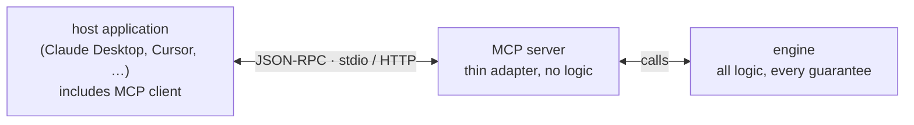

The Model Context Protocol (MCP) is an open standard, introduced by Anthropic in November 2024, for connecting AI applications to outside systems such as your CRM, the firm's single source of truth. Think of it as a universal plug. An **MCP server** is a small program that offers capabilities (tools the model can call, documents it can read, reusable prompts); an **MCP client** is the part of an AI app (Claude Desktop, Claude Code, Cursor, and most agent runtimes) that discovers those capabilities when it connects and lets the model use them mid-conversation. Write one server, and every MCP-capable app can use your system without custom integration work. Under the hood the two sides talk JSON-RPC, a simple convention for sending structured messages between programs; you rarely need to touch it directly.

## Why this matters for your fund

MCP is how you give the AI apps your team already uses a line into the firm's single source of truth. Install one small connector and a partner prepping for a founder call can ask Claude Desktop "have we talked to this founder before?" and get an answer drawn from your live CRM. Knowing what MCP is also protects your budget and your data: it has a real cost per conversation, and it is not a safety layer by itself. Both points are covered below.

One scoping note before the mechanics. Use MCP when you want a capability available *inside someone else's AI app*, such as checking the CRM from Claude Desktop. If you are building your own [agent](/reference/agents/) loop, you usually do not need MCP at all: you define [tools](/reference/tool-use/) directly in the API call (the API is the web service your code uses to talk to the model). MCP is a distribution mechanism, not a requirement for agents.

## The three roles

Every MCP setup has three parts. The names come up constantly, so it is worth keeping them straight:

| Role | What it is | Examples |
|---|---|---|
| Host | The AI application the user is talking to | Claude Desktop, Claude Code, Cursor |
| Client | The protocol handler inside the host, one per server connection | Built into the host |
| Server | Your process, exposing tools/resources over stdio or HTTP | `valentine mcp`, the official Attio MCP server |

The most common way a local server talks to its host is **stdio** (short for "standard input/output," the plain text channels every program has). The host starts your server program, messages flow over those channels, and logs go to a third channel called stderr. This has a sharp consequence: the output channel *is* the wire. Anything your server prints to standard output that is not a protocol message corrupts the connection. Every well-behaved stdio server sends its logs to stderr only.

## The thin MCP server pattern

The single most useful design decision for an MCP server: keep it thin. All business logic, all safety guarantees, and all rules live in an engine, an ordinary program that exists independently of MCP. The MCP layer is a small adapter that parses the tool call, invokes the engine, and passes back the result. If the adapter contains no logic, it cannot break a rule the engine enforces.

Here is the shape as a diagram. The guarantees live in the rightmost box; the MCP server in the middle only passes messages through.



### Example: one read-only tool over an agent loop

[valentine](https://github.com/80x-djh/valentine) is a pre-call prior-contact checker: it sweeps a fund's CRM and answers "has anyone here talked to this founder before?" Internally it runs a hand-rolled [agent loop](/reference/agents/) that makes multiple read-only CRM calls before submitting a verdict. Its MCP server exposes exactly **one tool**, and the inner loop stays hidden. The code below is that entire MCP surface: one tool definition and one handler that calls the engine.

```typescript
// src/mcp.ts (excerpt), the entire MCP surface is one tool definition
const TOOL = {
  name: "valentine_verdict",
  description:
    "Before a founder/company call, sweep the fund's CRM (read-only) and return a " +
    "verdict on whether anyone at the fund has touched this company or founder " +
    "before. Returns JSON: { target, verdict: 'clean'|'prior_contact'|'ambiguous', " +
    "summary, owner?, lastTouch?, status?, citations[] }. Never writes to the CRM.",
  inputSchema: {
    type: "object",
    properties: {
      target: { type: "string", description: "Company domain or company/founder name." },
    },
    required: ["target"],
  },
};

server.setRequestHandler(CallToolRequestSchema, async (req) => {
  const target = String(req.params.arguments?.target ?? "").trim();
  const cfg = loadConfig(); // same config the CLI reads
  const verdict = await lookup(makeClient(cfg), cfg.model, makeConnector(cfg), target);
  return { content: [{ type: "text", text: toJson(verdict, target) }] };
});
```

Even if you skip the code, three things about it are worth knowing:

- **The host sees one call.** From Claude Desktop's perspective, `valentine_verdict("acme.com")` is a single tool invocation. The multi-step CRM sweep happens inside `lookup`, invisible to the host. This keeps the host's conversation clean and its tool count low.
- **Read-only is structural.** There is no write tool to expose, because the engine has no write capability anywhere in its code. The MCP layer cannot grant an ability the engine does not have. See [read-only agents](/reference/read-only-agents/).
- **Config is shared, not duplicated.** The MCP server reads the same `~/.valentine/config.json` and environment variables (`VALENTINE_ATTIO_KEY`, `ANTHROPIC_API_KEY`) that the command-line version uses. One source of truth; the interfaces differ only in how they are reached.

### Example: an MCP surface that inherits its rules

cereal-milk (a meeting-notes-to-CRM tool; see [meeting notes to CRM, automatically](/guides/meeting-notes-to-crm/)) makes hard promises in its engine: what you preview is exactly what gets sent, a note is never poured into the CRM twice, the first send to any destination waits for an explicit confirmation, and sensitive text is redacted before anything leaves the machine. Its MCP interface (designed and stubbed in `src/mcp/server.ts`, not yet shipped) maps four tools (`list_inbox`, `preview_pour`, `pour`, `history`) one-to-one onto the same engine functions the web interface calls.

The design note in the repo states the principle: the MCP server is "a thin adapter with no business logic of its own, so it can never pour something the UI wouldn't, or skip a confirm the UI requires." Because every guarantee lives in the engine, any interface (web, MCP, a future command line) gets all of them automatically. If the guarantees lived in the user interface instead, adding an MCP interface would mean rebuilding them, and every rebuild is a chance to get one wrong.

## Configuring an MCP server

You connect a server to Claude Desktop by editing one settings file. On a Mac it lives at `~/Library/Application Support/Claude/claude_desktop_config.json`, and the entry below tells Claude Desktop how to start valentine's server.

```json
{
  "mcpServers": {
    "valentine": { "command": "npx", "args": ["-y", "valentine-agent", "mcp"] }
  }
}
```

After saving, restart Claude Desktop; it only reads this file when it launches. Claude Code registers servers from the terminal (the text window where you type commands) instead. This one command does the same job as the settings file above.

```bash
claude mcp add valentine -- npx -y valentine-agent mcp
```

Once it runs, the valentine tool appears in Claude Code's tool list automatically.

:::caution[Keep secrets out of tool arguments]
API keys and other secrets belong in the server's environment (most hosts support an `env` block per server), never in tool arguments. Arguments pass through the model, which means they can end up in logs and transcripts.
:::

## Trade-offs to weigh

- **The schema tax.** Every tool's name, description, and schema is sent to the model on every request, whether or not the tool gets used, and each send costs tokens (the units AI usage is priced in). A server with dozens of tools can consume tens of thousands of tokens per turn before any work happens. This is measurable and often decisive; see [CLI vs MCP](/reference/cli-vs-mcp/) for the analysis and [the benchmarks](/notes/cli-vs-mcp-benchmarks/) for measured numbers. Valentine's one-tool surface is partly a response to this: the tax scales with tool count, so expose verdicts, not plumbing.
- **A command line may serve agents better.** Agents that can run shell commands can drive a well-designed CLI (a program controlled by typed commands) with zero standing token cost. Valentine ships both interfaces for exactly this reason. MCP earns its place when the host cannot run commands (Claude Desktop) or when easy discovery matters more than tokens.
- **Debugging is awkward.** A stdio server has no web address you can test directly. When it misbehaves, you are reading logs from a process your host started for you. Keep the adapter thin enough that you can test the engine on its own and trust the adapter by reading it.
- **The standard is still moving.** MCP is young: its transport options, authentication, and capability negotiation have all evolved since launch. Pin the version of the software library you build on, and expect to revisit.
- **It is not a safety boundary by itself.** MCP transports tool calls; it does not police them. If your server exposes a destructive tool, every connected host can call it. The guarantees have to live in the engine, which is the argument for the thin-server pattern above and for the discipline in [automation safety](/reference/automation-safety/).

## See also

- [Tool use](/reference/tool-use/), the layer beneath MCP: how models call tools at all.
- [CLI vs MCP](/reference/cli-vs-mcp/): when a command line beats a protocol, with the token cost analysis.
- [Read-only agents](/reference/read-only-agents/), safety through the structural absence of write tools.
- [valentine](/projects/valentine/), the full project page for the example above.
